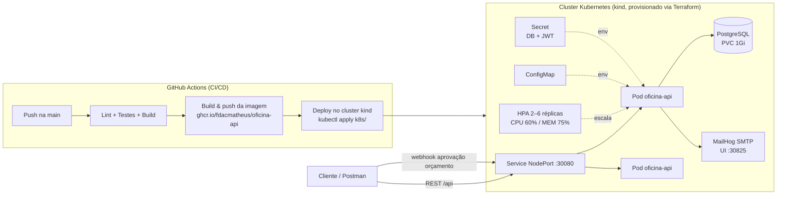

# Oficina API — Tech Challenge SOAT (Fases 1 e 2)

Back-end de um **Sistema Integrado de Atendimento e Execução de Serviços** para oficina mecânica. Gestão de **ordens de serviço, clientes, veículos, serviços e peças/insumos**, aplicando **DDD / Clean Architecture** em camadas.

Na **Fase 2**, a aplicação evoluiu para garantir **qualidade, resiliência e escalabilidade**: orquestração com **Kubernetes** (com **HPA**), provisionamento com **Terraform**, pipeline **CI/CD** com GitHub Actions e novas APIs no fluxo de OS (webhook de aprovação de orçamento, consulta de status, listagem priorizada e **notificação por e-mail** a cada mudança de status).

## Stack

- **NestJS** + **TypeScript**
- **PostgreSQL** + **TypeORM**
- **REST** com **Swagger** em `/docs`
- **JWT** (`@nestjs/jwt` + Passport)
- **Nodemailer** + **MailHog** (notificações de status por e-mail)
- **Jest** para testes unitários e de integração
- **Docker** + **docker-compose** · **Kubernetes** (kind) · **Terraform** · **GitHub Actions**
- Gerenciador de pacotes: **pnpm**

## Objetivos da Fase 2

- **Refatoração / Clean Architecture** — cada bounded context isolado em 4 camadas (`domain` puro, `application` com ports, `infrastructure` com adapters TypeORM/Nodemailer, `presentation` com controllers/DTOs).
- **Novas APIs de OS**:
  - `POST /api/ordens-servico` — abertura de OS com cliente, veículo, serviços e peças; retorna o `id`/`numero` únicos.
  - `GET /api/ordens-servico/:id/status` e `GET /api/publico/ordens-servico/:numero/status` — situação atual da OS.
  - `POST /api/publico/ordens-servico/:numero/orcamento` — **webhook** para notificação externa de aprovação/recusa do orçamento (`{ "aprovado": true|false }`).
  - `GET /api/ordens-servico` — listagem ordenada por **Em Execução > Aguardando Aprovação > Diagnóstico > Recebida**, mais antigas primeiro, **ocultando** (exclusão lógica da listagem) as finalizadas, entregues e canceladas.
  - **Notificação por e-mail** ao cliente a cada mudança de status (visível no MailHog).
- **Infraestrutura** — Docker/compose revisados, manifestos K8s em [`/k8s`](k8s), Terraform em [`/infra`](infra), pipeline em [`.github/workflows/ci-cd.yml`](.github/workflows/ci-cd.yml).

## Arquitetura



**Componentes**: API NestJS (2+ réplicas com probes em `/api/health`), PostgreSQL (Deployment + PVC), MailHog (SMTP de notificação), ConfigMap/Secret para configuração, HPA por CPU/memória.

**Fluxo de deploy**: push na `main` → build + testes → imagem Docker publicada no GHCR → manifestos aplicados no cluster → rollout + smoke test.

## Fluxo da Ordem de Serviço

```
RECEBIDA → EM_DIAGNOSTICO → AGUARDANDO_APROVACAO → EM_EXECUCAO → FINALIZADA → ENTREGUE
                                      │
                                      └─ recusa do orçamento (webhook) → CANCELADA
```

A cada transição o cliente é notificado por e-mail; a aprovação dá baixa automática no estoque das peças.

## Como rodar localmente (Docker)

```bash
cp .env.example .env
docker compose up --build
```

- API: http://localhost:3000/api
- Swagger (collection completa das APIs): http://localhost:3000/docs
- MailHog (e-mails enviados): http://localhost:8025
- pgAdmin: http://localhost:5050 (host interno: `db`, porta `5432`)

Sem Docker: `pnpm install && pnpm start:dev` (requer Postgres local; ajuste `DB_HOST` no `.env`).

## Deploy em Kubernetes

Com um cluster disponível (veja Terraform abaixo, ou qualquer cluster com `kubectl` configurado):

```bash
kubectl apply -f k8s/
kubectl -n oficina get pods -w
```

- API: http://localhost:30080/api (NodePort; via kind com as portas mapeadas pelo Terraform)
- MailHog UI: http://localhost:30825
- HPA: requer metrics-server (instruções em [`infra/README.md`](infra/README.md))

Para testar a escalabilidade automática, gere carga e observe:

```bash
kubectl -n oficina get hpa -w
# em outro terminal:
hey -z 2m -c 50 http://localhost:30080/api/publico/ordens-servico/1
```

## Provisionamento com Terraform

```bash
cd infra
terraform init && terraform apply
kubectl --context kind-oficina apply -f ../k8s/
```

Recursos criados (cluster kind, namespace, Secret, PostgreSQL com PVC) documentados em [`infra/README.md`](infra/README.md).

## CI/CD

Pipeline em [`.github/workflows/ci-cd.yml`](.github/workflows/ci-cd.yml):

1. **Build e testes** — install, ESLint, Jest, `nest build` (em push e PR).
2. **Imagem Docker** — build e push para `ghcr.io/fdacmatheus/oficina-api` (`latest` + SHA), somente na `main`.
3. **Deploy** — cria cluster kind, aplica os manifestos de `k8s/` (banco, MailHog, API, HPA), atualiza a imagem para o SHA do commit, aguarda o rollout e roda smoke test em `/api/health`.

## Scripts úteis

| Comando                   | Descrição                            |
| ------------------------- | ------------------------------------ |
| `pnpm start:dev`          | Sobe a API em modo watch             |
| `pnpm build`              | Compila para `dist/`                 |
| `pnpm test`               | Testes unitários                     |
| `pnpm test:cov`           | Cobertura (alvo ≥ 80% nos domínios)  |
| `pnpm lint`               | ESLint + auto-fix                    |
| `pnpm seed`               | Popula o banco com dados de exemplo  |
| `pnpm migration:generate` | Gera migration a partir das entities |
| `pnpm migration:run`      | Aplica migrations                    |

## Seed

**Automático** — por padrão, ao subir a API o seed roda no startup (env `AUTO_SEED=true`, idempotente). **Manual**: `pnpm seed`.

Cria: **admin** (`admin` / `admin123`), 2 clientes (PF + PJ), 3 veículos, 4 serviços, 4 peças com estoque e 1 OS de exemplo (em `AGUARDANDO_APROVACAO`).

## Collection das APIs

A documentação completa e executável está no **Swagger**: `http://localhost:3000/docs` (local) ou `http://localhost:30080/docs` (Kubernetes). O JSON OpenAPI para importar no Postman fica em `/docs-json`.

## Variáveis de ambiente

Veja `.env.example`. Em produção, **sempre** defina `JWT_SECRET` com valor forte e único e gerencie os Secrets fora do repositório.
